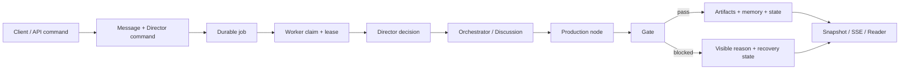

# AI Novel Factory 逐节点调通手册

更新时间：2026-07-13

这份手册把现役生产系统拆成可独立验证的节点。目标不是一次跑完整本书，而是先证明每个节点的输入、输出、持久化证据和失败恢复都成立，再逐层组合。

## 一、当前结论

当前系统不是“从头到尾都坏了”，而是三种问题叠在一起：

1. 前置链路已经大体可用：Provider、Style、Setting Review、Master Planning、Story Foundation、Chapter Blueprint 和 Readiness 都已有小项目或定向测试证据。
2. 第 1 章正文链路仍在逐门禁暴露真实问题：字数、场景卡执行、因果证据、人物抽取、角色身份、未批准配角、风格继承和记忆污染曾轮流成为阻塞点。
3. Worker 控制面存在比内容门禁更危险的问题：不可推进的 readiness 状态曾被反复 `advance -> blocked -> requeue`，旧项目 `untitled-novel` 的 `loopCount` 已达到 8522。当前租约已经过期，但数据库中仍有 3 个 active/runnable stale jobs，恢复 Worker 前必须先隔离或处理。

2026-07-13 的现场基线：

- `--plan-only` 已通过。
- 文本和 Style Evolution 路由均能连接 `deepseek-v4-flash`。
- AIGC detector 使用 `local-heuristic`，配置可用。
- Factory DB 里有 34 个项目、36737 条消息、6370 个项目知识源、408092 个 ready chunks。
- 当前没有有效 job lease，但有 3 个 stale/runnable jobs；不能直接启动 Worker 做新实验。
- `flow-cast-lock-probe-v7-fresh` 的最新真实第 1 章被人物漂移门禁阻塞：`沈蘅摇` 是误抽取且本地修复已覆盖，`胡书办` 是正文真实临时新增的未批准人物，仍是有效阻塞。

## 二、系统边界

### 2.1 唯一状态源

- 工作流状态：`.ai-novel-factory/factory.sqlite`
- 项目文件：`.ai-novel-projects/<project-id>/.ai-novel/`
- `.ai-novel/` 只存产物和缓存，不能成为另一套工作流状态。
- Web/Desktop、CLI、OpenCode plugin 都必须通过 `ai-novel-core` 和 Factory DB。

### 2.2 五层结构

| 层 | 负责人 | 作用 |
|---|---|---|
| Client | `apps/desktop`、CLI、plugin | 发命令、渲染 snapshot/SSE，不推进状态 |
| API | `studio-server.ts`、standalone server | 校验请求、创建命令/job、返回投影 |
| Control | Director、Worker、job lease、checkpoint、drift guard | 决定下一步、执行/暂停/恢复 |
| Production | orchestrator、discussion、writing pipeline | 生成设定、规划、正文、质检和记忆 |
| Persistence | Factory DB、artifact files、Super Graph、memory/RAG | 保存可恢复证据 |



## 三、调试纪律

每个节点只有同时满足以下条件才算通过：

1. 输入明确且来自上一节点的正式接口。
2. 节点只执行一次；重复调用必须幂等或明确拒绝。
3. DB 有对应 message、event、artifact/job/state 证据。
4. 文件产物存在、内容非空、可通过 `/api/artifacts/preview` 打开。
5. UI 时间线能看见开始、完成或失败，不能只写服务器日志。
6. 失败状态可恢复，且不会 busy-loop、悬挂 streaming message 或吞掉 job lease。

调试时还要遵守：

- 不启动旧 Worker 恢复现有 stale jobs。
- 每次只使用一个固定的小项目，推荐 3 章、每章 2500 字。
- 每次只开放一个节点，关闭 autopilot 自动串联。
- 每个节点保存独立 acceptance report 和 project snapshot。
- 节点失败时不继续下游，不靠自动 repair 掩盖根因。
- `plan-only`、单节点测试、小组合、2 章、4+ 章、全书，严格按这个顺序升级。

## 四、控制面节点

这些节点不写小说内容，但决定系统是否会重复执行、丢状态或无法恢复。应先于生产节点调通。

| ID | 节点 | 输入/触发 | 必须输出 | 单节点通过条件 | 当前判断 |
|---|---|---|---|---|---|
| C00 | 构建与运行时一致性 | `src`、`dist` | 最新 `dist` | freshness check 不报旧构建 | 待当前完整测试确认 |
| C01 | Factory DB 打开/迁移 | root dir | schema、operational status | 核心表可读；迁移幂等 | 基线可用 |
| C02 | API 启动 | server command | `/api/health`、`/api/ready` | health 和 ready 语义区分正确 | 基线可用 |
| C03 | Provider 路由加载 | DB `llm_configs/routes` | text/style/image route | secret 不外泄，capability 路由正确 | text/style 已实测通过 |
| C04 | Provider health check | active route | 成功/可恢复失败消息 | 失败不会创建生产 job | 已通过 |
| C05 | Canonical message 写入 | command/message | `messages`、`message_parts` | 同一流式步骤复用 messageId | 基线可用，需查悬挂流 |
| C06 | Artifact 写入与预览 | artifact path | file + DB artifact + preview | 三者路径一致 | 规划节点已通过，正文逐项验证 |
| C07 | Job 创建 | autopilot/start | queued/idle job | 同项目不重复创建冲突 job | 待独立复测 |
| C08 | Job claim/lease/heartbeat | runnable job | owner、lease、heartbeat | 单 worker 独占；过期可恢复 | 基线存在，恢复边界待复测 |
| C09 | Director 决策 | state + user message | discuss/advance/retry/interrupt | 每次 decision/start/complete 可审计 | 基线可用 |
| C10 | 无进展检测 | before/after snapshot | backoff 或 pause | 同 stage/同 reason 不得高速重试 | **P0 未通过：历史 loopCount 8522** |
| C11 | Readiness 阻塞传播 | readiness blocked | paused/blocked job | 不 requeue，不继续 advance | **P0 未通过** |
| C12 | Stale job 恢复 | 过期 lease/job | 单次恢复或人工阻塞 | 不恢复旧脏项目，不生成重复 job | 待独立复测 |
| C13 | Streaming 清理 | 超时/手动 retry | failed/cancelled old message | 无永久 streaming | 定向测试已有，需真实超时复测 |
| C14 | Checkpoint | 每次 discuss/advance | checkpoint file + graph record | 可从 checkpoint 解释上一步 | 基线可用 |
| C15 | Drift guard | discussion before/after | ok/correcting/blocked | blocked 后 Worker 停止 | 待真实复测 |
| C16 | Recovery budget | blocked chapter | retry 或 recoveryBlocked | 达上限后必须人工处理 | 基线可用，需组合验证 |
| C17 | Stop/interrupt | stop API/signal | job pause、state 保存 | 无 in_progress 遗留 | 待独立复测 |
| C18 | 完成判定 | all chapters/gates | complete job + complete state | chapter facts 连续、无 active job | 下游 canary |

## 五、主生产流程节点

### 5.1 项目与风格

| ID | 节点 | 入口/负责人 | 输入 | 必须输出 | 通过条件 | 当前判断 |
|---|---|---|---|---|---|---|
| P00 | 创建 managed project | `POST /api/projects` | title、idea、chapters、words、profile | project row、initial state、user message | DB、registry、workspace 一致 | 基线可用 |
| P01 | 初始化项目资产 | orchestrator init | initial state | `.ai-novel/` 目录、state、dossier seed | 不出现第二套状态 | 基线可用 |
| P02 | Style seed | style init | style prompt、genre/profile | seed prompt、runtime/ledger | timeline 可见 | 已有 stop 证据 |
| P03 | Style candidates | generate-candidate | seed + iteration | candidate artifacts | 候选非空、数量正确 | 已有 stop 证据 |
| P04 | Style evaluator/critic | style loop | candidate | structured evaluation | 失败项具体，不是泛化评分 | 已有实现，trace 仍需补齐 |
| P05 | Prompt refiner/loop controller | style loop | evaluation | next prompt/loop decision | 达标或明确继续 | 已有实现 |
| P06 | Generation verification | style loop | candidate + AIGC | verification result | AIGC/禁忌/结构均有证据 | 已通过小探针 |
| P07 | Freeze preview | API | best candidate | freeze preview/contract | 字段完整且可预览 | 已有实现 |
| P08 | 用户批准/拒绝 Style | approve/reject | candidate id + action | approved contract 或 rejection | drafting 前必须显式批准 | 已通过 stop-after-style |
| P09 | Chapter inheritance adapter | style freezer | approved contract | rulebook/references/anti-patterns | 每章加载同一冻结合同 | 第 1 章有真实证据 |

### 5.2 讨论、设定和规划

| ID | 节点 | 入口/负责人 | 输入 | 必须输出 | 通过条件 | 当前判断 |
|---|---|---|---|---|---|---|
| P10 | 用户创作指令 | `/api/chat` | user message | durable user message | 只写一次 | 基线可用 |
| P11 | Discussion context package | `discussion.ts` | mission、state、consensus、RAG | current-context.md | 长上下文折叠可开 | 已有实现 |
| P12 | Showrunner opening | discussion role 1 | context | opening brief | agent_turn + message | 待逐 role 真实核查 |
| P13 | World Architect | discussion role 2 | opening + context | world constraints | 具体世界规则 | 同上 |
| P14 | Author | discussion role 3 | prior turns | story proposal | 不越阶段 | 同上 |
| P15 | Editor | discussion role 4 | prior turns | structural critique | 问题可执行 | 同上 |
| P16 | Reviewer | discussion role 5 | prior turns | risks/gates | 风险具体 | 同上 |
| P17 | Prose Stylist | discussion role 6 | prior turns | style advice | 不覆盖批准合同 | 同上 |
| P18 | Showrunner synthesis | discussion role 7 | all turns | consensus | 收敛而非重写另一套设定 | 同上 |
| P19 | Discussion writeback | discussion | synthesis | consensus archive、target asset、dossiers、message parts | 全部可预览 | 已补实现，需真实复测 |
| P20 | Setting review packet | orchestrator | worldbuilding consensus | `setting-freeze.md` | status=review_required | 已通过小组合 |
| P21 | Setting approve/reject | setting API | human action | `setting-review-approval.json` | 未批准不能规划 | 已通过小组合 |
| P22 | Protagonist confirmation gate | confirm API/planner | concrete profile | protagonist.md + message | 具体姓名、欲望、伤口、行为、声音、关系 | 已通过探针 |
| P23 | Master outline | `writeProductionMasterOutline` | approved setting + protagonist | `master-outline.md` | canonical protagonist/cast + 因果结构 | 已通过 planning 探针 |
| P24 | Story foundation bundle | story bible writer | master outline + consensus | world matrix、story bible、plot architecture、character dynamics、foreshadowing ledger、writing plan、contract | 资产具体、互相一致 | 已通过 foundation 探针 |
| P25 | Chapter blueprints | blueprint writer | foundation + chapter tasks | chapter-*.md | 每章 5+ scene cards、角色锁、差异点、handoff | 3 章真实审计通过，长期重复风险仍需观察 |
| P26 | Story asset repair | repair API | weak/legacy assets | regenerated assets | 不能越过 protagonist/approval gate | 已有实现，只作恢复路径 |
| P27 | Foundation approval | approve API | foundation fingerprint | approval artifact | 修改基础资产后 approval 失效 | 已通过 readiness 探针 |
| P28 | Production readiness | `blockDraftingUntilReady` | style + foundation + blueprints + memory | pass 或 issueCodes | blocked reason 精确且 Worker 停下 | 内容判断可用；控制传播 P0 未通过 |

### 5.3 单章生产

| ID | 节点 | 输入 | 必须输出 | 通过条件 | 当前判断 |
|---|---|---|---|---|---|
| P30 | 章节任务领取 | first pending task | task=in_progress | 严格按章节顺序 | 基线可用 |
| P31 | 蓝图加载/修复 | chapter blueprint | executable blueprint | 缺失时补齐并记录原因 | 已有实现 |
| P32 | Continuity contract | blueprint + prior final/memory + cast | locked protagonist/cast/anchors | 第 2 章以后无主角锁则阻塞 | 已有实现 |
| P33 | Context package | foundation、style、RAG、memory、blueprint | chapter context artifact | prompt 只带摘要和引用，文件可开 | 部分可用，需真实核查 |
| P34 | Segment plan | scene cards + word target | 5 个左右 segment contracts | 每段角色、目标、冲突、转折、hook、预算明确 | 已加强，真实字数仍波动 |
| P35 | Plot material | segment contract | plot brief/material | timeline/tool part 可见 | 部分可用 |
| P36 | Dialogue material | segment contract | dialogue brief/material | 角色声音和归属正确 | 部分可用 |
| P37 | Narration material | segment contract | narration brief/material | 不生成新 canon | 部分可用 |
| P38 | Character action material | segment contract | action brief/material | 必需角色承担动作 | 部分可用 |
| P39 | Continuity material | segment contract | continuity brief/material | 锚点、物件、handoff 一致 | 部分可用 |
| P40 | Assembly material | previous materials | assembly brief/material | 不重复、不膨胀 | 部分可用 |
| P41 | Segment generation | compact prompt + materials | segment body | 字数落在 segment budget，LLM trace 完整 | **P0/P1：字数曾严重膨胀** |
| P42 | Segment manifest/artifacts | segment result | manifest + all subartifacts | 实际字数、来源、状态齐全 | 已有真实产物 |
| P43 | Chapter assembly | all segments | initial draft | scene 顺序和前后尾衔接正确 | 有真实产物，稳定性待验 |
| P44 | Quality report | draft + contracts | quality report | 失败定位到 gate/场景/角色/字数 | 已显著增强 |
| P45 | Quality revisions | report + draft | revised draft(s) | 最多重试、字数 80%-115%、不能越修越坏 | focused tests 通过，真实波动仍有 |
| P46 | Polish/Naturalness | passed/blocked draft | polished draft | 语义保持、不引入新角色/新设定 | 仍可能引入未批准人物 |
| P47 | AIGC detect/repair | polished body | detection + optional repair | 检测不可用时明确降级；修复后复检 | 本地 detector 可用 |
| P48 | Final gate | final body + all contracts | passed/blocked gate | 见下一张 gate 表 | 当前真实阻塞在人物漂移 |
| P49 | Artifact save/version | draft/reviewed/final/report/memory | files + version manifest + DB artifacts | blocked 稿可保存但 reader 不可发布 | 已有实现 |
| P50 | Memory Keeper | final body | chapter memory | 只提取正文事实，不吃 report metadata | 已修污染，需真实复测 |
| P51 | Character dossiers | body + old dossiers | cleaned dossiers | 不保留假名字/流程词；关系有证据 | 已修多轮，真实复测中 |
| P52 | Relationship graph | dossiers | relationships.json/relations.md | 节点仅 canonical cast | 已有实现 |
| P53 | Style fingerprint/drift | first chapter + contract | profile + inheritance verification | warning/blocked 语义一致 | 有真实证据，sample overlap 风险 |
| P54 | Chapter fact/state commit | final gate | complete 或 blocked task | DB state、artifact、event 一致 | 基线可用 |
| P55 | Retry/recovery | blocked task | pending/recoveryBlocked | 清理旧 streaming；不无限 retry | 控制面仍需组合修复 |
| P56 | Next chapter handoff | completed chapter | next pending chapter | memory/anchors 被下一章消费 | 尚未稳定走到 2 章真实组合 |
| P57 | Book completion | all tasks complete | runtime complete | reader/all audits 通过 | 尚未证明 |

### 5.4 Final Gate 子节点

P48 必须拆开测，不能只看一个总分。

| ID | Gate | 通过证据 | 当前风险 |
|---|---|---|---|
| G01 | 字数 | 正文体在目标 80%-115% | 修订曾过长/过短，focused tests 已补 |
| G02 | Approved Style | contract、freezer、adapter ready | 基线可用 |
| G03 | Style conformance | contract rules 有正文证据 | approved sample token overlap 偏低 |
| G04 | Narrative naturalness | 无模板腔、碎句、解释腔、重复段 | 仍需真实长期样本 |
| G05 | Semantic preservation | 关键事实、否定约束不漂移 | focused tests 已有 |
| G06 | Scene-card execution | 角色/目标/冲突/转折/hook 落地 | 抽象卡片误报已修，需复测 |
| G07 | Causal execution | anchors、choice、consequence、handoff | 抽象锚点误报已修，需复测 |
| G08 | Character profile | 欲望、行为、声音、关系压力 | 人名抽取污染风险高 |
| G09 | Character voice | 对白归属和差异化 | 邻近角色误归属已修 |
| G10 | Unplanned character drift | 仅使用批准 cast 或无名职能称谓 | **当前真实阻塞：`胡书办`** |
| G11 | Identity conflict | 已知角色身份不被改写 | `沈蘅` 妹妹/父亲问题已有硬阻塞 |
| G12 | Canon/asset drift | 地域、税种、物件、关系锚不换套 | 仍需正文级系统审计 |
| G13 | AIGC | passed 或明确允许的 degraded/bypass | 本地可用 |
| G14 | Reader readiness | quality/style/AIGC/version 均通过 | 只能作下游 canary |

## 六、辅助流程

| ID | 流程 | 节点顺序 | 验证目标 |
|---|---|---|---|
| A01 | Cover | context -> visual brief -> prompt -> image provider -> image/metadata artifact | 失败不能阻塞主生产；产物可预览 |
| A02 | Interrupt/Replan | user interrupt -> scope review -> affected assets -> replanning -> resume | local/chapter_arc/global 影响范围正确 |
| A03 | Knowledge bootstrap | resources -> source -> chunks -> embeddings -> ready | 不重复摄入；失败可重试 |
| A04 | Project artifact indexing | artifact event -> knowledge job -> chunks/embeddings | 不产生无限重复任务 |
| A05 | Knowledge recall | query -> retrieve -> citations -> prompt context | 召回具体且受 context budget 控制 |
| A06 | Super Graph | state/artifact/checkpoint -> nodes/edges -> violations | graph 只做约束/投影，不成为第二状态源 |
| A07 | Reader | snapshot -> chapter -> search -> version compare/lock | blocked chapter 不可绕门禁发布 |
| A08 | AIGC batch | batch scan -> refine -> recheck -> mark workflow complete | 与逐章 gate 状态一致 |
| A09 | Settings | GET/POST writing settings | 设置进入 DB，运行时读取同一值 |
| A10 | OpenCode plugin | `novel-init` / `novel-status` -> core | 不创建 legacy workflow |
| A11 | CLI/TUI | init/status/chat/advance -> core/API | 与 Web 使用同一 project/state |
| A12 | Observability | DB events/messages -> status/SSE -> UI renderer | timeline 不丢 request/tool/artifact/error |

## 七、推荐调通顺序

### Phase 0：隔离控制面

1. C00-C06：构建、DB、API、Provider、message、artifact。
2. C07-C13：job、lease、无进展、readiness blocked、stale recovery、stream cleanup。
3. 在 C10/C11 通过前，不启动长期 Worker，不恢复旧 job。

### Phase 1：只跑前置生产

1. P00-P09：项目 + 完整 Style loop。
2. P10-P22：讨论、setting review、主角确认。
3. P23-P28：master outline、foundation、blueprints、approval、readiness。

组合停止点：

```bash
rtk node scripts/run-production-acceptance.mjs --plan-only
rtk node scripts/run-production-acceptance.mjs --stop-after-style
rtk node scripts/run-production-acceptance.mjs --stop-after-planning --auto-approve-style --auto-approve-setting-review
rtk node scripts/run-production-acceptance.mjs --stop-after-foundation --auto-approve-style --auto-approve-setting-review --auto-approve-foundation
```

### Phase 2：只跑一章内部节点

顺序固定为：

1. P30-P34：task、blueprint、continuity、context、segment plan。
2. P35-P42：每个 subcall 和 segment artifact。
3. P43-P47：assembly、quality、revision、naturalness、AIGC。
4. G01-G14：逐 gate 审计。
5. P49-P55：artifact、memory、state、recovery。

现有组合命令：

```bash
rtk node scripts/run-production-acceptance.mjs \
  --resume-project-id flow-foundation-probe \
  --chapters 3 \
  --chapter-words 2500 \
  --min-total-words 7000 \
  --max-total-words 9000 \
  --auto-approve-style \
  --auto-approve-setting-review \
  --auto-approve-foundation \
  --stop-after-chapters 1
```

但这仍不是严格的“单节点 runner”。后续应给 acceptance runner 增加 node target/checkpoint resume 能力，例如 `--stop-after-node P34`、`--resume-from-node P35`，这样失败后不用重烧整章。

### Phase 3：小组合

1. 1 章完整通过，并且 Worker 不自动重试。
2. 2 章通过，验证 P56：第 1 章 memory/cast/handoff 被第 2 章消费。
3. 4 章通过，验证重复、关系弧、伏笔和 checkpoint 恢复。
4. 6+ 章后再启用语言模板、开头/结尾重复、终局结构等长程审计。

### Phase 4：自动化和全书

1. full-auto Worker 先跑 2 章。
2. 人工中断一次并恢复。
3. 模拟 provider transient error、HTTP timeout、stale lease。
4. 最后才跑目标章节数和总字数。

## 八、当前优先级

### P0：组合前必须解决

1. C10/C11：readiness blocked 后 Worker 必须 pause/blocked，不能继续 requeue。
2. 隔离现有 3 个 stale/runnable jobs，避免新 Worker 恢复旧项目。
3. P41/G01：segment 和 revision 字数预算必须稳定。
4. G10/P46：Naturalness/repair 遇到未批准人物时，应替换为批准 cast 或无名职能称谓，不能每次生成 blocked 新稿。

### P1：一章通过后立即验证

1. P33-P42 的 request/response/tool/artifact timeline 完整性。
2. P50-P52 记忆、角色档案和关系图无污染。
3. G12 资产漂移硬审计。
4. P56 两章连续性。

### P2：长跑前验证

1. Stale job、超时、网络错误、manual retry 的恢复矩阵。
2. 4+ 章重复、关系弧、伏笔和章节差异。
3. Reader/version lock 和 publish readiness。
4. Cover、batch AIGC、plugin/CLI 等辅助流。

## 九、每个节点的记录模板

每跑一个节点，在调试记录中保存：

```text
Node ID:
Project ID:
Input artifact/message/job:
Command or endpoint:
Started at:
Finished at:
Expected state transition:
Actual state transition:
DB evidence:
File evidence:
Timeline evidence:
Pass/fail:
Failure category: input | provider | persistence | gate | recovery | UI
Exact blocker:
Next node allowed: yes/no
```

## 十、第一轮建议

第一轮不要从 P00 重跑整条生产线。先处理控制面：

1. 备份/隔离当前 Factory DB。
2. 审计并暂停 3 个 stale/runnable jobs。
3. 为 C10/C11 增加回归：同一 readiness issueCodes 连续出现时，job 进入 paused/blocked，Director 不再生成新的 advance command。
4. 用一个 fresh 3 章项目只跑到 P28，确认 blocked/pass 都不会触发 busy-loop。
5. 然后从已经通过 foundation 的项目继续 P30-P55，只攻第 1 章。

只有 C10/C11 和第 1 章全节点都通过，才进入第 2 章组合。
