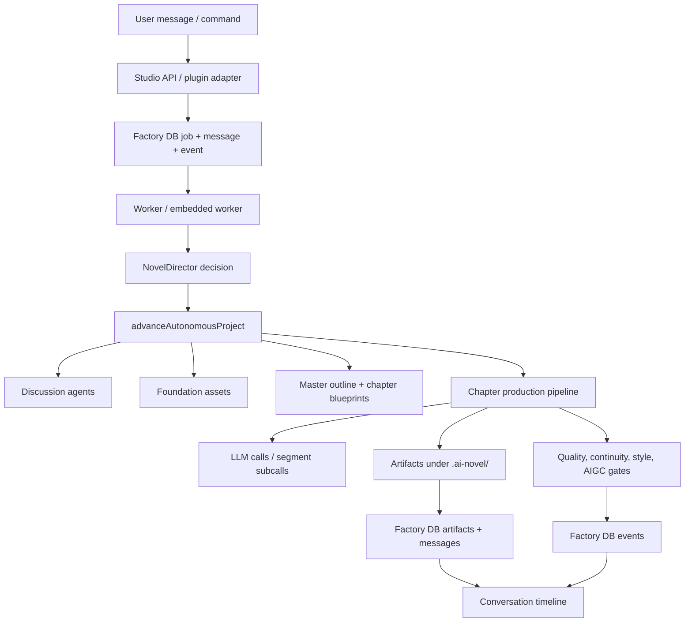

# Production Flow Map

This is the working map for debugging the AI Novel Factory end to end. The goal is to make every stage observable, testable, and composable before trusting the whole long workflow.

The user-facing experience should feel like Codex or Claude: user input, agent output, LLM calls, tool/subcalls, status updates, generated files, gates, and errors all appear in one durable conversation timeline. Long prompts and generated files should be folded by default, expandable through artifacts.

For the active Chinese debugging board and current attack order, see `docs/FLOW_DEBUG_BOARD.md`. This file is the full reference map; the board is the day-to-day checklist for tuning one segment at a time.

## Source Of Truth

- Durable workflow state: `.ai-novel-factory/factory.sqlite`
- Project artifacts/cache: `.ai-novel/`
- Main state machine: `packages/ai-novel-core/src/orchestrator.ts`
- Writing execution: `packages/ai-novel-core/src/writing-pipeline.ts`
- Durable messages/events/artifacts: `packages/ai-novel-core/src/factory-db.ts`
- Live UI projection: `apps/desktop/src/live-discussion.mjs` and `apps/desktop/src/discussion-renderer.mjs`

## Golden Flow



## Stage Contracts

| Stage | Owner | Required input | Required output | Durable evidence | Must be visible in conversation |
|---|---|---|---|---|---|
| Project intake | API + FactoryDb | User title, idea, target chapters, style/profile settings | Managed project row, initial state, user message | `projects`, `messages`, `events` | User message, accepted project summary |
| Worldbuilding discussion | `discussion.ts` | User brief, current stage, target asset | Role turns and consensus | `workflow_runs`, `agent_turns`, `messages`, `CONSENSUS_UPDATED` | Agent turns, risks, decisions, consensus artifact |
| Setting review | `advanceAutonomousProject`, setting review approve/reject API | Consensus, protagonist/style context, user review action | `setting-freeze.md` review packet, `setting-review-approval.json`, cover attempt | `ARTIFACT_RECORDED`, `SETTING_REVIEW_BLOCKED`, `PROJECT_STATE_UPDATED`, workflow-control messages | Review-required setting artifact plus approve/reject artifact messages; master planning stays blocked until approval |
| Master planning | `writeProductionMasterOutline` | Setting freeze, project plan, resources | `master-outline.md` | plan artifact + `WRITING_PROGRESS` | Master outline status and artifact |
| Story foundation | `writeProductionStoryBibleAssets` | Consensus, protagonist, style, resources, master outline | world matrix, story bible, plot architecture, character dynamics, foreshadowing ledger, writing plan | plan artifacts + writing progress | Each saved file or folded asset bundle; foundation interface audit must preview `master-outline.md` before validating cast locks |
| Chapter blueprinting | `writeAllDetailedChapterBlueprints` | Story foundation + canonical planning cast + chapter tasks | per-chapter detailed blueprints | plan artifacts + writing progress | Chapter blueprint artifact, canonical cast lock, and differentiators |
| Readiness gate | `blockDraftingUntilReady` | Style approval, foundation approval, chapter blueprints | pass/block reason | runtime state + events | Clear block reason or pass card |
| Draft context packaging | `createDraftBody` | Blueprint, memory, RAG, style, world slice | context package JSON/Markdown | context artifact + writing progress | Folded context package with open link |
| Segment drafting | `generateProductionTextWithLlm` + segment helpers | Segment contract, prior tail, compact prompts | LLM response, segment body, submaterials | `WRITING_PROGRESS`, segment artifacts | Request, stream/response, subcall materials, segment artifact |
| Quality review | `runQualityGateWithRevisions` | Draft, blueprint, gates | quality report, retry/block/pass | checkpoint artifact + writing progress | Gate score, reason, report artifact |
| Naturalness/AIGC | polish + detector | Reviewed draft, gate result | final draft or blocked repair output | chapter/report artifacts + events | Detector status and repair attempts |
| Memory update | Memory Keeper | Final draft and continuity contract | chapter memory, character dossier updates, relationship graph | memory artifacts + memory rows | Memory artifact and changed character records |
| Completion/recovery | Orchestrator + worker | chapter task status | next pending/recovery/complete state | events, jobs, project snapshot | Clear next action and blocked/retry reason |

## Message And Event Interface

Every workflow-visible step should emit a `WritingProgressEvent` or canonical `NovelMessage`.

Required fields for production flow messages:

- `messageId`: stable across streaming updates for the same semantic step.
- `conversationId`: `writing:<projectId>`, `discussion:<projectId>`, `artifacts:<projectId>`, or a narrower durable scope.
- `type`: `user`, `agent`, `status`, `tool`, `artifact`, `image`, or `error`.
- `status`: `queued`, `streaming`, `completed`, `failed`, or `cancelled`.
- `data.content`: human-readable markdown.
- `message_parts`: at minimum one markdown part; add artifact/json/tool parts when applicable.

Additional writing trace fields now expected on `writing_progress` payloads:

- `workflow.kind`: `status`, `llm_request`, `llm_response`, `llm_retry`, `llm_error`, `artifact_saved`, `gate`, `knowledge_recall`, or `tool_call`.
- `workflow.groupId`: stable grouping for one LLM/tool operation.
- `workflow.expandableArtifactPath`: path for folded context or generated files.
- `llm`: role name, prompt budget, response length, temperature, retry attempt.
- `artifacts`: all generated files from the step, not only the primary artifact.
- `tools`: internal subcalls/material generators exposed as tool-like timeline entries.

## Artifact Interface

Generated files must be both written to disk and recorded in Factory DB.

Each artifact should have:

- path relative to project root,
- kind,
- status,
- enough metadata to identify chapter/stage/pass,
- a matching artifact message or message part,
- a preview line short enough for the UI,
- full content available by opening the path.

Critical artifact groups:

- `.ai-novel/plans/setting-freeze.md`
- `.ai-novel/plans/master-outline.md`
- `.ai-novel/plans/story-bible.md`
- `.ai-novel/plans/world-matrix.md`
- `.ai-novel/plans/plot-architecture.md`
- `.ai-novel/plans/character-dynamics.md`
- `.ai-novel/plans/foreshadowing-ledger.md`
- `.ai-novel/plans/writing-plan.json`
- `.ai-novel/plans/chapter-blueprints/chapter-*.md`
- chapter context packages,
- segment artifacts and submaterials,
- `.ai-novel/chapters/*.draft.md`
- `.ai-novel/chapters/*.reviewed.md`
- `.ai-novel/chapters/*.final.md`
- `.ai-novel/reports/*-quality.md`
- `.ai-novel/memory/*-memory.md`
- character dossier JSON/Markdown and relationship graph.

## Step-By-Step Debug Order

1. Intake and message persistence
   - Verify one user command creates one user message and one durable project/job event.
   - Check `/api/messages` and `factorySnapshot.recentMessages`.

2. Discussion transcript
   - Verify each role turn appears as an agent message.
   - Verify consensus updates are written as artifacts and messages.
   - Known risk: agents can sound useful while producing vague or premature stage claims.

3. World foundation quality
   - Verify world matrix, story bible, character dynamics, plot architecture, and foreshadowing ledger contain concrete story-specific facts.
   - Fixed/verified: `Known Cast` and character profile contracts now sanitize workflow/vocabulary terms before treating them as names.

4. Master outline and chapter blueprints
   - Verify each chapter has unique causal objective, pressure pattern, evidence object, relationship turn, world-rule touchpoint, and handoff.
   - Fixed/verified: new-project causal plans now inject project-specific differentiators into chapter objectives, scene pressure, protagonist decisions, and irreversible consequences without making hard gates depend on unnatural literal labels.
   - Fixed/verified: English project briefs are no longer split into filler chapter anchors such as `Chinese`, `long`, `form`, `mystery`, or `about`; new chapter seeds extract story signals such as `档案小吏`, `税册`, `家族债务`, `司天监气象记录`, and `不可能矛盾`.
   - Fixed/verified: master outline canonical cast now propagates into story foundation assets and chapter blueprints, so a master protagonist such as `顾夜舟` cannot silently become a different blueprint protagonist such as `沈砚`.
   - Fixed/verified: `Character Spine` headings such as `### 沈渡（主角）` are now valid canonical cast evidence, and placeholder names like `角色1` cannot be promoted to the story foundation protagonist.
   - Fixed/verified: placeholder character dossiers such as `角色1`, `antagonist-force`, and `relationship-axis` no longer pollute `character-dynamics.md` or relationship maps when a canonical planning cast exists.
   - Fixed/verified: deterministic chapter blueprints, including later chapters generated before any draft is complete, now inherit `Canonical Protagonist` and `Canonical Cast` from story assets instead of showing `Contract status: blocked`, `Locked protagonist: (首章待锁定)`, or `Known cast: none`.
   - Remaining risk: some fixture/test paths can still produce repetitive chapter bodies if prior tail repeats.

5. Readiness and style gates
   - Verify drafting blocks until approved style and story foundation gates are satisfied.
   - Verify block reason is visible to user as a status message.

6. Draft context packaging
   - Verify full prompt context is saved as a folded artifact.
   - Verify LLM prompt only receives compact summary plus artifact reference.

7. Segment drafting and subcalls
   - Verify every LLM call has started/streaming/completed/failed states under the same message id.
   - Verify plot/dialogue/narration/character_action/continuity/assembly submaterials are visible as artifacts/tool parts.

8. Quality and repair
   - Verify report explains actionable failures, not just generic score.
   - Verify retry attempts are visible and do not silently consume recovery budget on transient provider failure.
   - Fixed/verified: character-profile gate no longer treats action/object phrases such as `常年`, `方言`, `沈槐坐`, or `朱砂编号` as people.
   - Fixed/verified: quality repair prompts now translate `WORD_COUNT_CHECK` failures into explicit compress/expand directives before retrying.

9. Memory and character update
   - Verify final chapter changes update chapter memory, character dossiers, and relationship graph.
   - Verify those memory artifacts are visible in the same timeline.

10. Full run composition
   - Run a small 2-chapter acceptance path first.
   - Then run 4+ chapters and check no stage, chapter status, artifact count, message timeline, or memory row regresses.

## Stage Debug Commands

Use these as stop points while debugging interface contracts. Prefer a fresh small project first, then resume the same project id as each stage becomes stable.

```bash
rtk node scripts/run-production-acceptance.mjs --plan-only
rtk node scripts/run-production-acceptance.mjs --stop-after-style
rtk node scripts/run-production-acceptance.mjs --stop-after-planning --auto-approve-style
rtk node scripts/run-production-acceptance.mjs --stop-after-foundation --auto-approve-style --auto-approve-foundation
rtk node scripts/run-production-acceptance.mjs --stop-after-chapters 1 --auto-approve-style --auto-approve-foundation
```

Stage stop evidence:

- `waiting_after_style`: style candidate and freeze gate are visible, but planning has not consumed them yet.
- `waiting_after_planning`: setting review, story assets, master outline, chapter tasks, and blueprints have been generated; use this to inspect whether downstream interfaces are concrete enough before approval.
- `waiting_after_foundation`: production readiness has passed, including story foundation approval; use this before drafting.
- `waiting_after_chapters`: at least the requested chapter count is complete; use this to inspect generated chapter files, quality reports, memory updates, and conversation trace before full-book generation.

Each stop writes `stageInterfaceAudits` into the acceptance report. The audit checks:

- runtime stage and production readiness,
- Factory artifact paths recorded for the project,
- message timeline count, message part types, and artifact paths visible in messages,
- expected generated files for the stage,
- whether matched artifacts open through `/api/artifacts/preview`.

## Acceptance Evidence

Minimum proof for each stage:

- DB evidence: messages, message parts, events, artifacts, jobs, project state.
- File evidence: expected artifacts exist and contain stage-specific content.
- UI evidence: live discussion entries include user, agents/status, LLM/tool traces, and artifact links.
- Test evidence: targeted unit/integration tests cover the interface being changed.
- Runtime evidence: a small acceptance run reaches the expected next stage without hidden state mutation.

## Current Known Interface Gaps

- `setting-freeze.md` now declares `review_required`; `/api/production/setting-review/approve` and `/api/production/setting-review/reject` write `setting-review-approval.json` and expose it through workflow-control timeline artifact parts. Core advance now blocks at `setting_review` until approval exists.
- Story foundation assets are more concrete than before, but the worldbuilding discussion to frozen foundation loop still needs a human-readable approval artifact.
- Master outline and chapter blueprints have first-pass differentiators and a character participation contract, but the upstream worldbuilding-to-foundation loop still needs stronger concrete cast creation and human approval before those facts become canon.
- Chapter quality gates can still fail on real character-profile strictness after false-positive names are filtered; the next debugging pass should separate genuine missing dossier details from gate threshold/prompt-shape problems.
- Planning runs can still be expensive because the acceptance runner performs Style Evolution before each fresh stop point; use a resumed clean project or add a lighter planning-only fixture before repeating long LLM probes.
- Real `--stop-after-planning` acceptance can currently be blocked before planning by Style Evolution sample generation. Observed failures: one run rejected a secondary candidate because it used heuristic fallback; a resumed one-candidate run was blocked because the sample was truncated and failed Generation Verification Gate. This is a style-stage reliability issue, separate from the planning cast/continuity handoff fixed below.
- The UI can render artifact/tool parts, but the dedicated expand/collapse affordance for structured trace groups is still basic.
- Acceptance reports expose artifact paths relative to the managed project, but not always the managed project root. For projects under `.ai-novel-projects/<projectId>/`, this can make direct local inspection ambiguous unless the API/UI resolves the project root before rendering open/preview links.
- The acceptance runner now has stop points for style, planning, foundation/readiness, and a requested completed chapter count. Each stop point also writes a `stageInterfaceAudits` section that verifies expected artifacts, message visibility, artifact previewability, and planning cast consistency between `master-outline.md`, `character-dynamics`, and `chapter-blueprints/chapter-001.md`.
- GitNexus `detect_changes` is documented, but the local CLI command is not available as `rtk gitnexus detect_changes`; use the eval-server fallback before committing.

## Resolved Interface Fixes

- `Known Cast` pollution: `sanitizeKnownCastNames` now keeps concrete names such as `沈砚`, `周掌柜`, or `Steward Song`, while excluding workflow/vocabulary terms such as `成语`, `章末期待`, `关系网络`, `主线线索`, and `东奔西撞` from cast contracts. Verified by targeted contract tests and the full core suite.
- Chapter character false positives: `extractChinesePersonNames` now filters common non-name nouns and action/object tails that were causing gates to demand dossiers for fake people such as `常年`, `方言`, `沈槐坐`, and `朱砂编号`. Verified by targeted extraction tests and by re-evaluating the previous failed chapter report.
- Word-budget repair: `runQualityGateWithRevisions` now adds an explicit compression/expansion instruction when the quality report contains `WORD_COUNT_CHECK`, so an over-budget draft such as `3583/2500` is repaired toward the accepted range instead of being elaborated further.
- Chapter plan specificity: `buildChapterCausalPlan` now carries concrete project terms from the initial idea into `previousInput`, `causalObjective`, `protagonistDecision`, `irreversibleConsequence`, and `characterStateDelta`, while keeping continuity anchors and foreshadowing requirements natural enough for gates and prose to satisfy.
- English brief seed cleanup: `extractProjectIdeaTerms` now maps English story briefs to concrete story signals and filters generic filler words before they enter chapter causal contracts. Verified by initializing a new English-brief project and checking its first chapter tasks.
- Blueprint character participation: `createDetailedChapterBlueprint` now emits a `Character Participation Contract` with fallback scene character roles for first chapters, required participation rules, and a memory-write requirement so chapters do not drift into nameless plot scaffolding.
- Story asset context packaging: `loadProductionStoryAssetContext` now prioritizes structured contracts and core story assets before miscellaneous files, and compacts very long table/JSON lines so more relevant artifacts appear in folded draft context.
- Canonical cast propagation: `writeProductionStoryBibleAssets` reads `master-outline.md`, extracts the canonical planning cast, writes it into `story-foundation-contract.json`, `character-dynamics.md/json`, and the story asset context, and `createDetailedChapterBlueprint` treats that cast as authoritative. The story asset repair API now rebuilds detailed chapter blueprints as well as story foundation assets.
- Planning cast table pollution: `extractPlanningCastContract` now reads only explicit character declarations from the master outline and ignores state-ledger dimension tables, so `状态维度`, `身份安全性`, `对雨档的信仰`, `心理压力等级`, and `用名/暂用名` cannot become canonical cast members. Verified against the real failed `flow-interface-planning-cast-probe` master outline, which now resolves to protagonist `沈渡` and cast `沈渡`, `孟迁`, `孟书吏`.
- Planning protagonist heading lock: `extractPlanningCastContract` now treats character-spine headings as explicit cast declarations and story foundation refuses to use internal placeholders such as `角色1` as canonical protagonists. This prevents chapter 2+ blueprints from drifting from `沈渡/郑七` into a new cast such as `徐昭/沈六娘`.
- Placeholder dossier cleanup: `createProductionStoryBibleAssets` now filters default placeholder dossiers out of story foundation lenses when a master-outline planning cast exists, and derives relationship pressure from the canonical cast instead of emitting `角色1 -> relationship-axis` scaffolding.
- Planning continuity/profile handoff: `createDetailedChapterBlueprint` and the LLM blueprint prompt now merge the story asset planning cast into continuity and character-profile contracts. This keeps later planning-stage blueprints active and aligned even before chapter 1 has produced a completed quality-gate protagonist lock.
- Planning consistency audit: `run-production-acceptance.mjs` now fails the planning stop point if the master-outline protagonist is missing from character dynamics or chapter-001, or if the blueprint locks a different protagonist.
- Planning cast fragment filter: `extractPlanningCastContract`/`sanitizeKnownCastNames` now reject narrative fragments such as `那些`, `查的`, `他是因为复制这些`, `入侵者按错误年份`, plus English concept tokens such as `minor`, `archive`, `clerk`, and `ledgers`; parenthetical names such as `旧书摊老板（孟老伯）` normalize to `孟老伯`. The acceptance runner now parses story/character/blueprint cast locks and fails planning if any noisy lock is present.
- Planning repair stop point: when the planning interface audit fails only because of story planning consistency, the acceptance runner now records the failed audit, calls the existing `story-assets/repair` API, and reruns the audit. Core planning artifacts are previewed through direct expected paths, so a long blueprint regeneration cannot hide story assets behind message pagination. If repair cannot produce a concrete protagonist because `master-outline.md` never named one, the stop point now fails with `planning protagonist missing` instead of silently approving `待冻结主角` or a support cast member.
- Story foundation protagonist gate: `writeProductionStoryBibleAssets` now refuses to freeze story foundation assets when `master-outline.md` has a Character Spine like `主角（未命名档案小吏）` but no concrete protagonist name. It emits `story_foundation_blocked`, records `STORY_FOUNDATION_BLOCKED`, writes `.ai-novel/plans/protagonist-naming-brief.md`, and the acceptance runner reports a readable `blockedReason` instead of treating the repair attempt as an internal crash.
- Protagonist naming close-loop: discussion confirmation now writes a canonical protagonist lock into `protagonist.md` and `dossiers.json`; story asset repair rebuilds `master-outline.md` when the existing visible Character Spine cannot expose that concrete protagonist. Rebuilt master outlines put `### 沈渡（主角）` and `Canonical Protagonist: 沈渡` at the top of Character Spine, and demote embedded dossier headings so `## pending-protagonist-name` cannot truncate downstream section parsing.
- Planning token cleanup: canonical cast sanitization now rejects `待冻结主角` and false names cut from phrases such as `不合时宜`; persisted chapter causal plans now normalize old English story-signal leftovers such as `minor/archive/clerk/ledgers` into Chinese planning signals before master outline, story assets, and detailed blueprints consume them.

## Working Rule

Do not debug the full novel run first. Debug one stage contract at a time, using this order:

1. Can we see the step?
2. Can we open its generated files?
3. Are its inputs specific and valid?
4. Are its outputs specific and valid?
5. Does the next stage consume the right interface?
6. Does the combined two-stage run still behave?

## Endpoint Contract Matrix

This is the interface-first checklist for tuning the flow one segment at a time. For each segment, the endpoint payload is not considered correct just because the internal state advanced; it must also expose the right user-visible messages, artifacts, and next-step signals.

| Segment | Driver endpoints | Required response contract | Durable evidence to inspect | Next consumer |
|---|---|---|---|---|
| Project intake | `POST /api/projects`, `GET /api/projects` | `projectId`; selected project in `projects`; project summary `source=db` when Factory DB meta exists; stage `worldbuilding_dialogue`; no blocking kickoff discussion | `projects` row, initial `PROJECT_CREATED`/status message, `.ai-novel/state.json` | Studio project switcher, `/api/status`, `/api/messages` |
| Canonical timeline | `GET /api/messages`, `GET /api/transcript`, `GET /api/status?includeTranscript=1` | `/api/messages` is primary and returns `messages`, compatibility `entries`, pagination; `/api/transcript` is compatibility/export; status omits transcript unless requested | `messages`, `message_parts`, discussion log artifact only as fallback | Desktop discussion renderer, plugin adapters |
| Provider and route setup | `POST /api/llm-configs`, `POST /api/llm-config-routes`, `GET /api/llm-configs`, `POST /api/provider-test` | Secrets redacted; active route ids stable; provider test result visible before project init if needed | system settings, config rows, provider test status message | Style evolution, discussion, drafting |
| Style loop | `POST /api/style-evolution/init`, `candidate`, `generate-candidate`, `freeze-preview`, `accept`, `approve`, `GET /api/style-evolution` | Candidate versions; evaluator/freezer/generation verification status; accepted sample; approved contract with inheritance `enforced` and verification `passed` | style evolution artifacts, style contract, messages with LLM/gate traces | Production readiness and chapter style inheritance |
| Discussion/foundation input | `POST /api/chat`, `POST /api/chat-stream`, `GET /api/messages` | One user message, role turns, final consensus, target asset path, no premature stage transition claims | `workflow_runs`, `agent_turns`, discussion messages, consensus artifact | `advanceAutonomousProject`, story foundation assets |
| Workflow advance | `POST /api/advance`, `GET /api/status` | Stage transition only if gates pass; visible blocked/pass reason; `projectRuntime` and `productionReadiness` agree | jobs/events, state stage, status messages | next stage handler, desktop workflow panel |
| Story foundation repair/rebuild | `POST /api/production/story-assets/repair`, `POST /api/production/story-foundation/approve` | Written story assets and chapter blueprints; approval artifact; readiness moves from blocked to pass only after style + story approvals; if the master protagonist is missing, a blocked `protagonist-naming-brief.md` artifact is emitted instead of refreezing bad assets | story foundation files, blueprint files, `protagonist-naming-brief.md`, `story-foundation-approval.json`, artifact messages | drafting gate and chapter pipeline |
| Artifact preview | `GET /api/artifacts/preview`, `GET /api/chapters/preview`, `GET /api/assets/image` | Project-root resolved path; safe preview content; no ambiguous managed-project relative path | artifact row plus readable file on disk | UI open/preview links |
| Drafting and chapter production | `POST /api/advance`, `POST /api/chapters/retry`, `GET /api/status`, `GET /api/messages` | Context package, LLM request/response trace, segment artifacts, quality gate, AIGC result, final artifact, memory update all visible | `WRITING_PROGRESS`, chapter artifacts, report, memory, character graph | reader snapshot and next chapter continuity |
| Reader/publication | `GET /api/reader-snapshot`, `GET /api/reader-chapter`, `GET /api/reader-search`, `POST /api/reader-chapter-version` | Readable chapters only; `publishReadiness.ready` true only when base assets, quality, style inheritance, and AIGC pass; locked version cannot bypass missing gates | chapter versions manifest, quality report, memory, style drift report | reader UI, workflow completion |
| Long-run acceptance | `scripts/run-production-acceptance.mjs` stop points | Stop report includes `stageInterfaceAudits`; each audit states expected files, message visibility, previewability, cast/blueprint consistency | acceptance report JSON under `.ai-novel-factory/acceptance-runs` | next segment debugging decision |

## Current Debug Ladder

We will use this as the active order, and only move down when the previous rung has direct evidence.

| Rung | Scope | Status | Evidence | Next action |
|---|---|---|---|---|
| 1 | Project intake + canonical timeline | Passing | `rtk npm test`; server test `standalone api returns persisted transcript, consensus, and context packet`; `GET /api/projects` summary now returns `source=db` when DB meta exists | Treat as baseline; do not reopen unless messages disappear or project summary regresses |
| 2 | Style loop interface | Stop point proven | `--stop-after-style` now exits `waiting_after_style` instead of failing; report `2026-07-12T23-19-26-343Z.json` opens style history/runtime/runs/ledger/contract and records latest candidate v2 as `verification=passed`, `freezer=ready`, `fallbackSignals=[]`; style candidate API messages now include artifact parts for conversation preview | Remaining polish: expose every internal LLM evaluator/refiner/freezer request as its own collapsed trace; then move to discussion/foundation |
| 3 | Discussion to foundation | Interface gate passing; content cleanup in progress | `--stop-after-planning` on `production-acceptance-2026-07-12-13` first detects the legacy bad master outline, repairs it, then passes planning audit in report `2026-07-13T00-26-43-926Z.json`; rebuilt `master-outline.md` exposes `### 沈渡（主角）` and `Canonical Protagonist: 沈渡` inside the visible Character Spine; canonical cast is now `沈渡` only, and chapter causal fields no longer use `minor/archive/clerk/ledgers` as planning tokens | Attack blueprint non-duplication next: adjacent detailed blueprints still share about `0.81-0.89` normalized common-line ratio |
| 4 | Foundation approval to drafting readiness | Passing in test fixtures | production acceptance and longrun tests pass after style/readiness fixes | Recheck with real provider output, not only deterministic test mode |
| 5 | Draft context and segment trace | Partially implemented | context package and segment artifact trace fields exist; UI renders artifact/tool parts | Need a small chapter run report that confirms every LLM/material subcall has a timeline entry and preview link |
| 6 | Reader/publication endpoints | Passing in acceptance | production acceptance asserts 3 readable chapters and `publishReadiness.ready === true` | Keep as downstream canary while fixing upstream quality |

## Active Next Segment: Discussion To Foundation

Style stop/resume is now usable enough to act as a gate. The next segment under active repair is discussion-to-foundation, because this is where vague worldbuilding, missing cast, generic setting freeze, wrong mainline planning, and duplicated chapter blueprints currently enter the production chain.

Current concrete failure from the resumed production probe:

- Earlier corrupted assets had consumed polluted cast locks: `那些`, `查的`, `他是因为复制这些`, `入侵者按错误年份`.
- The acceptance runner now records that failure, calls `POST /api/production/story-assets/repair` when `autoRepairStoryAssets` is enabled, and reruns the same planning interface audit.
- Core story assets are checked by direct artifact preview paths, so long blueprint repair runs cannot push `story-bible.md`, `character-dynamics.md`, or `story-foundation-contract.json` out of the recent message window and create false missing-file failures.
- After the protagonist naming confirmation, the resumed probe now repairs the legacy master outline and passes the planning interface audit. The earlier blocker was real, but the current remaining risk has moved from interface wiring to content quality: whether the regenerated foundation assets are specific enough and whether chapter blueprints are distinct.
- Source fix: planning cast sanitization rejects pronoun fragments, sentence fragments, English concept tokens, and role-labeled support cast promotion. `上司（谢主簿）`, `遗属孙辈（沈三娘）`, and `旧书摊老板（孟老伯）` can remain cast members, but they cannot become the protagonist unless the master outline explicitly says so.
- Source fix: old persisted causal plans are normalized at consumption time, so repaired story assets and blueprints no longer treat `minor`, `archive`, `clerk`, or `ledgers` as chapter pressure vectors; these remain visible only when quoting the original English core idea.
- Current gate behavior: if `master-outline.md` has no visible concrete protagonist, story foundation repair is blocked before it can rewrite `story-foundation-contract.json`, `character-dynamics.md`, or chapter blueprints. Once discussion writes a confirmed protagonist into `protagonist.md`, repair regenerates the master outline before story foundation assets and chapter blueprints, so downstream files consume the same protagonist lock.

Questions to answer with evidence:

1. Does the discussion transcript contain the user prompt, each role turn, final consensus, and generated artifact links?
2. Are setting freeze, master outline, story bible, plot architecture, character dynamics, and foreshadowing ledger specific to the user idea rather than template scaffolding?
3. Does the canonical cast contain named characters with pressure, desire, wound, speech marker, habits, and relationship deltas?
4. Are chapter blueprints distinct per chapter, with different objectives, scenes, required characters, foreshadowing operation, and next-chapter handoff?
5. Does `/api/status.productionReadiness` explain exactly whether drafting is blocked by missing foundation approval, missing blueprint files, style approval, or concrete asset sparsity?

Stop command for this segment:

```bash
rtk node scripts/run-production-acceptance.mjs --resume-project-id production-acceptance-2026-07-12-13 --auto-approve-style --stop-after-planning
```

Expected proof before moving to foundation:

- `stageInterfaceAudits[].stage === "planning"` and expected story assets are previewable.
- Master outline protagonist appears in character dynamics and chapter 001 blueprint.
- `planningConsistency.details.noisyLocks` is empty.
- Report `2026-07-13T00-15-32-440Z.json` meets these interface conditions; the next rung should use these files to audit content specificity rather than re-debug protagonist visibility.
- Report `2026-07-13T00-26-43-926Z.json` also passes after token cleanup; next evidence target is reducing blueprint repetition and increasing named supporting-cast/relationship specificity.
- `planningConsistency.details.masterProtagonist` is a concrete named character, not empty and not a role/function label.
- Chapter 001 blueprint has a concrete scene sequence, named characters, causal objective, and handoff.
- Message timeline exposes the generated asset paths so the desktop can open and preview them.
- Any vague/template asset causes the stop report to fail with a specific issue.
